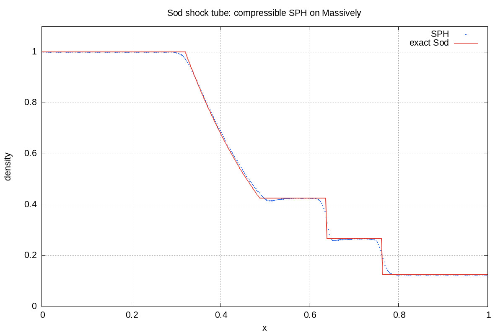
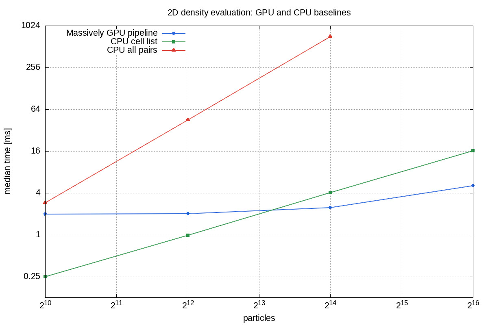

# sph-gpu

A GPU prototype of compressible Smoothed Particle Hydrodynamics (SPH),
implemented with [Massively v0.80](https://github.com/akiradeveloper/massively)
and CubeCL/WGPU.

The solver stores the fixed cell-neighborhood relation as a CSR graph and sorts
the particles by cell at every step. It composes the particles in each cell
with adjacent cells through nested `SegmentIterator`s, allowing density,
pressure, and artificial viscosity to be evaluated on the GPU without
materializing a neighbor list for every particle pair.

Implemented features include:

- one- and two-dimensional solvers with a fixed smoothing length `h`;
- static neighborhood CSR with three cells in 1D and nine cells in 2D;
- one- and two-dimensional cubic-spline kernels;
- an ideal-gas equation of state, a symmetric pressure term, and Monaghan-type
  artificial viscosity;
- symplectic Euler integration and reflective rectangular boundaries;
- physical validation with the Sod shock tube; and
- GPU differential tests against a CPU all-pairs implementation, `proptest`
  properties, and performance benchmarks.

## Validation experiment

The JPEG files below are reproducible artifacts tracked in `workspace/plot/`.
The results were obtained on an AMD Ryzen 7 7735U with a Radeon 680M, using
Rust 1.96.0 and the WGPU backend.

The sampled-density $L_1$ error for the Sod shock tube is `0.004199`. The
solution reproduces the rarefaction wave, contact discontinuity, and shock.

### Sod shock tube



## GPU performance



The table reports median timings for a two-dimensional density snapshot after
warm-up over five repetitions. The GPU timing includes cell-ID computation,
sorting, offset construction, density, the equation of state, and host
transfer. The CPU cell-list timing includes only list construction and density,
so the measurement boundary favors the CPU implementation.

| particles | GPU | CPU cell list | CPU all pairs | CPU cell / GPU |
|---:|---:|---:|---:|---:|
| 1,024 | 1.976 ms | 0.247 ms | 2.876 ms | 0.125x |
| 4,096 | 2.018 ms | 0.984 ms | 44.764 ms | 0.488x |
| 16,384 | 2.457 ms | 4.060 ms | 711.865 ms | 1.653x |
| 65,536 | 5.109 ms | 16.204 ms | — | 3.171x |

At 65,536 particles, the maximum relative density difference from the CPU
cell-list implementation was `5.89e-6`.

## Running the experiments

The experiments require Rust, a GPU backend supported by CubeCL, Ruby/Rake,
and gnuplot. Run these commands from the repository root:

```sh
# Run the shock tube and performance benchmark, then regenerate both plots.
rake -f workspace/Rakefile all

# Run either experiment separately.
rake -f workspace/Rakefile shocktube
rake -f workspace/Rakefile performance

# Run a short GPU smoke test.
rake -f workspace/Rakefile run:smoke
```

Numerical CSV files and metrics are generated under `workspace/dat/` and are
excluded from Git. The gnuplot scripts and generated images are stored in
`workspace/draw/` and `workspace/plot/`, respectively.

## Testing

```sh
cargo test --workspace
cargo clippy --workspace --all-targets -- -D warnings
```

The test suite covers:

- even symmetry, non-negativity, compact support, and two-dimensional rotational
  symmetry of the cubic-spline kernel;
- completeness, uniqueness, degree, and symmetry of the 1D and 2D CSR rows;
- agreement between nested-`SegmentIterator` GPU density and CPU all-pairs
  density;
- finite and positive state values within the domain after one 1D or 2D step;
  and
- known states of the exact Sod Riemann solution.

## Paper

The paper describes the implementation challenges involved in mapping SPH to
the GPU and their solution in Massively using cell CSR, lazy permutation, and
nested `SegmentIterator`s. The latest English version is
[paper/paper.pdf](paper/paper.pdf), accompanied by an equivalent Japanese
version at [paper/paper-ja.pdf](paper/paper-ja.pdf). Both PDFs can be rebuilt
using only `just` and Docker:

```sh
just --justfile paper/justfile
```

The Docker image contains the English and Japanese LaTeX environments. It
mounts the repository read-write and updates `paper/paper.pdf` and
`paper/paper-ja.pdf`. The source files are [paper/paper.tex](paper/paper.tex)
and [paper/paper-ja.tex](paper/paper-ja.tex); the bibliography is stored in
[paper/references.bib](paper/references.bib).

## Directory layout

```text
sph-gpu/                 library crate
experiments/shocktube/   Sod shock tube
experiments/benchmark/   GPU/CPU density benchmark
workspace/draw/          gnuplot scripts
workspace/plot/          tracked plots
paper/                   paper source, justfile, Dockerfile, latest PDFs
```
